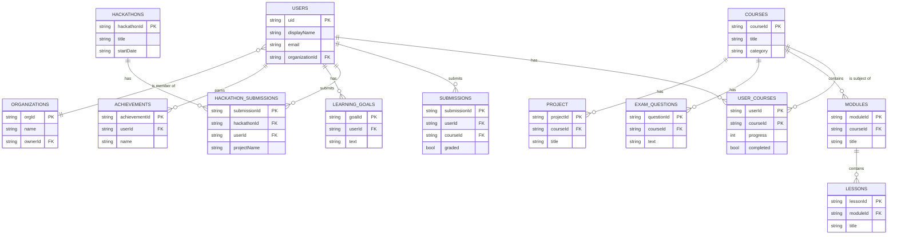

# Manda Network - Visual Framework

This document provides a visual representation of the application's architecture, user flows, and component interactions using Mermaid diagrams.

## High-Level Architecture

```mermaid
graph TD
    subgraph CLIENT [Client (Next.js/React)]
        A[User Interface] --> B{React Components};
        B --> C[ShadCN UI];
        B --> D[Tailwind CSS];
        A --> E[Next.js App Router];
    end

    subgraph SERVER [Server-Side (Next.js)]
        E --> F[Server Components];
        E --> G[Server Actions];
    end

    subgraph BACKEND [Backend Services]
        H[Firebase Auth]
        I[Firebase Realtime DB]
        J[Genkit AI Flows]
        K[Firebase Storage]
    end

    G --> H;
    G --> I;
    G --> J;
    G --> K;
    
    subgraph AI_MODELS [AI/ML (Genkit)]
        J --> L[Google AI Platform];
    end

    style CLIENT fill:#D6EAF8,stroke:#333,stroke-width:2px
    style SERVER fill:#D1F2EB,stroke:#333,stroke-width:2px
    style BACKEND fill:#FCF3CF,stroke:#333,stroke-width:2px
    style AI_MODELS fill:#FDEDEC,stroke:#333,stroke-width:2px
```

## User Onboarding Flow

This diagram illustrates the logic for the new user tutorial.


## Security Visual Framework

This diagram illustrates the security layers, from user authentication to database access rules.


## Database Framework

This diagram shows a more detailed version of the Firebase Realtime Database schema and relationships.


